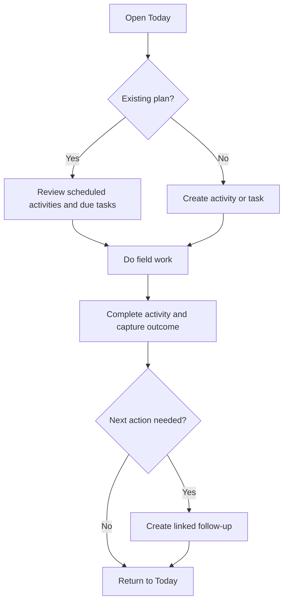

# RM Calendar — Critical Workflows

**Version:** 0.1  
**Status:** Complete specification baseline  
**Depends on:** [Product Bible](Product-Bible.md), [Domain Model](Domain-Model.md), [Phase 0 Discovery](Phase-0-Discovery.md)

## 1. Why these workflows are critical

The first release succeeds only if a field worker can reliably do three things:

1. Plan the work that matters.
2. Record what happened while it is fresh.
3. Turn the outcome into a visible next action.

Everything in the beta must make one of these easier or safer.

## 2. Experience rules shared by every workflow

- **No dead ends:** every completed action offers a clear next step or return to the daily agenda.
- **Fast by default:** essential fields are visible first; optional detail never blocks routine completion.
- **Explicit persistence:** saving creates a visible confirmation. Offline saves instead show a non-alarming `Saved on this device — waiting to sync` state.
- **Preserve intent and reality:** scheduled time and actual completion time are distinct.
- **Safe correction:** users can edit, reschedule, reopen, or cancel without losing the original record history.
- **One primary context:** use at most one primary Contact and one primary Place in quick flows. An Activity may have no primary Contact. Advanced multi-contact workflows can be added later without complicating beta.
- **No network dependency for core work:** planning, completion, notes, tasks, and follow-ups must work offline.

## 3. Workflow map



## 4. Workflow 1 — Plan work

### User goal

Create a reliable plan for a field interaction or independent task, with the context needed to act on it later.

### Trigger

The user chooses `Add` or selects an available time in the calendar.

### Minimum inputs

| Input | Required? | Notes |
| --- | --- | --- |
| Activity title/type | Yes | A default type and title may be supplied by context. |
| Date and time | Yes for an Activity | An Activity uses either a timed range or an all-day date. An independent Task may have no due date or time. |
| Contact | No | Strongly suggested when the activity is relationship-based. |
| Place | No | Suggested from the Contact’s recent/default place. |
| Objective | No | Short, pre-work context; never required to save. |
| Reminder | No | Defaults are configurable by the user. |

### Happy path

1. The user opens the quick-create action from the calendar or agenda.
2. The app proposes a time based on the selected slot or current time.
3. The user selects an existing Contact or creates one inline with only a name required.
4. The app proposes a recent or default Place when available; the user may confirm, change, or skip it.
5. The user enters a title/type and optional objective.
6. The user saves.
7. The Activity enters `Scheduled`, appears in the calendar and daily agenda, and has a local sync operation queued if offline.

### Decisions and edge cases

| Situation | Required behavior |
| --- | --- |
| The contact does not exist. | Allow inline creation with name only, then return to the activity without losing entered data. |
| The user needs only a reminder/action, not a time block. | Create a Task rather than forcing an Activity. |
| The selected time overlaps another Activity. | Show the overlap clearly; allow the user to save anyway because field work often changes. |
| A place has no map coordinates. | Save the place and address normally; mapping is optional and must not block planning. |
| The user closes or navigates away with unsaved edits. | Preserve a local draft and clearly offer to discard it. |
| The user is offline. | Save locally with a queued sync operation; no core fields are disabled. |
| The planned activity is later moved. | Keep the Activity identifier and history; update the schedule rather than duplicating it. |

### Acceptance criteria

```gherkin
Scenario: Schedule an activity from a calendar slot
  Given a user is viewing a day in the calendar
  When they choose an available time slot and save an activity
  Then the activity appears in that time slot
  And it is visible in the daily agenda
  And its status is Scheduled

Scenario: Plan work without a connection
  Given the device has no network connection
  When the user creates and saves an activity
  Then the activity remains visible after restarting the app
  And it is marked as waiting to sync
  And no entered data is lost

Scenario: Create a contact while planning
  Given the user cannot find the intended contact
  When they create a contact inline and return to the activity
  Then the new contact is linked to that activity
  And the activity's other entered details remain intact

Scenario: Save an overlapping activity
  Given a user has an activity already scheduled in a time range
  When they save another activity that overlaps that range
  Then the overlap is shown clearly before saving
  And the user may still save the activity

Scenario: Save an all-day activity
  Given a user creates an activity without a specific time
  When they select an all-day date and save it
  Then the activity is scheduled for that date without a start or end time

Scenario: Preserve a planning draft
  Given a user has entered details for a new activity but has not scheduled it
  When they save it as a draft or leave the creation flow
  Then the entered details are retained locally
  And the draft does not appear as a scheduled calendar commitment

Scenario: Reschedule planned work
  Given a Scheduled activity exists
  When the user moves it to a different date or time
  Then the activity keeps its identifier
  And its prior schedule remains in its immutable history
  And only the updated schedule appears in the calendar
```

## 5. Workflow 2 — Complete and capture work

### User goal

Turn a real interaction into trustworthy history without an administrative burden.

### Trigger

The user opens a scheduled Activity from Today or Calendar and chooses `Complete`; or starts a quick capture for an unplanned interaction.

### Minimum inputs

| Input | Required? | Notes |
| --- | --- | --- |
| Completion action | Yes | Sets the completion timestamp. |
| Outcome | No for beta | A structured short outcome can be added later; a note is sufficient initially. |
| Note | No | Optimized for short, useful field notes. |
| Next action | No | Opens the follow-up workflow only when needed. |

### Happy path: planned work

1. The user opens a `Scheduled` Activity.
2. The detail view shows Contact, Place, objective, schedule, and prior context without forcing an edit.
3. The user selects `Complete`.
4. The app sets the actual completion time to now, while retaining the scheduled interval.
5. The user can add an outcome/note immediately or choose `Skip for now`.
6. The app asks a lightweight decision: `Any next action?`
7. The user creates a follow-up or returns to Today.
8. The Activity is `Completed`, remains in history, and queues any sync change when offline.

### Happy path: unplanned work

1. The user selects `Quick capture` from Today or a Contact.
2. The app pre-fills current date/time and the current Contact context where available.
3. The user adds a title/type and optional note.
4. The user saves as `Completed`.
5. The activity joins the contact’s history and weekly review like any planned work.

### Decisions and edge cases

| Situation | Required behavior |
| --- | --- |
| The activity was not actually completed. | Offer `Reschedule` or `Cancel`, not only `Complete`. |
| Completion happens much later than scheduled. | Record actual completion time; do not silently rewrite the planned time. |
| The user accidentally completes an activity. | Allow `Reopen`, returning it to Scheduled while retaining a history record of the correction. |
| The user needs to add a note later. | Let them add/edit Notes after completion; it must not be all-or-nothing at completion time. |
| A user worked without a pre-existing plan. | Quick capture creates a complete Activity with actual time; planning is never required retroactively. |
| The user is offline. | Completion, notes, and next actions save locally and appear immediately in history. |
| Two devices change the same activity. | Do not silently discard either change. If automatic reconciliation is not possible, mark the Activity `needs attention` and present a user-resolvable conflict. |

### Acceptance criteria

```gherkin
Scenario: Complete a planned activity
  Given a Scheduled activity has a planned time and linked contact
  When the user completes it at a different time
  Then the planned time remains unchanged
  And an actual completion time is recorded
  And the activity appears in the contact history

Scenario: Capture unscheduled work
  Given a user has no planned activity for an interaction
  When they create a quick capture and save it as completed
  Then it appears in today's completed activity list
  And it is included in the weekly activity summary

Scenario: Correct an accidental completion
  Given a user has completed an activity accidentally
  When they reopen it
  Then the activity returns to Scheduled
  And the correction is retained in the record history

Scenario: Surface an unresolved concurrent edit
  Given two devices make incompatible changes to the same activity
  When synchronization cannot reconcile them automatically
  Then neither version silently overwrites the other
  And the activity is visibly marked as needs attention
  And the user can access a conflict-resolution path
```

## 6. Workflow 3 — Create and manage a follow-up

### User goal

Make the next commitment visible and connected to why it exists.

### Trigger

The user selects `Create follow-up` while completing a completed Activity or opens the follow-up action from the detail view of a completed Activity.

### Minimum inputs

| Input | Required? | Notes |
| --- | --- | --- |
| Follow-up kind | Yes | `Task` or `Scheduled Activity`. |
| Title | Yes | May be pre-filled from the source activity. |
| Due date / time | Yes | A Task requires a due date (time optional); an Activity requires a timed range or all-day date. |
| Contact | Pre-filled | The source activity’s primary Contact is carried forward but can be changed. |
| Place | Optional | May be carried forward only if still relevant. |

### Happy path

A Contact is pre-filled only when the completed source Activity has a primary Contact. The user can always change or clear it.

1. The user chooses `Create follow-up` from a completed Activity.
2. The app asks whether the next action is a Task or a scheduled Activity.
3. The app pre-fills a title and relevant Place from the source Activity, and pre-fills its primary Contact only if the source has one.
4. The user chooses a due date/time and optional reminder.
5. The user saves.
6. The app creates the target Task or Activity and a Follow-up link to the source Activity.
7. The new item appears in the appropriate agenda/calendar and in the source Activity’s follow-up section.

### Decisions and edge cases

| Situation | Required behavior |
| --- | --- |
| No next action is needed. | The user dismisses the prompt; the completed activity remains valid. |
| The next action is uncertain. | Create a Task with a due date rather than forcing a calendar time block. |
| A reminder is due while offline. | The app uses device-local notification where enabled; the record stays visible even if delivery is unavailable. |
| The contact is no longer relevant. | The user can clear or replace it; the Follow-up link still preserves the origin. |
| The follow-up is deleted/cancelled. | Preserve the source link and show its final state in the source Activity history. |
| A user creates multiple follow-ups. | Allow many; each has its own explicit source link. |
| The user creates a follow-up offline. | Save both target record and source link locally as one durable logical action, then synchronize safely. |
| The source Activity is not completed. | Do not offer or create a Follow-up link; the user must complete the source Activity first. |

### Acceptance criteria

```gherkin
Scenario: Create a scheduled follow-up from completed work
  Given a completed activity is linked to a contact
  When the user creates a scheduled follow-up for a future time
  Then the new activity is linked to the same contact by default
  And the source activity shows the new follow-up
  And the new activity appears on the future calendar date

Scenario: Create a task follow-up
  Given a user finishes an activity but does not know the next appointment time
  When they create a task follow-up with a due date
  Then the task appears in the due-work agenda
  And it retains a link to the source activity

Scenario: Follow up offline
  Given the device is offline
  When the user saves a follow-up task from a completed activity
  Then both the task and its source link survive an app restart
  And both are marked as waiting to sync

Scenario: Create a follow-up atomically
  Given a completed activity
  When the user saves a follow-up
  Then exactly one target Task or Activity and one source link are created together
  And if either cannot be saved locally, neither is presented as successfully created

Scenario: Do not create a follow-up from incomplete work
  Given an Activity is Draft, Scheduled, or Cancelled
  When the user views its detail
  Then creating a Follow-up link is unavailable
```

## 7. Cross-workflow offline and sync contract

The following behavior is required in every critical workflow:

1. The app reads from its local data store; a connection is not needed to display already available data.
2. New and edited records receive locally generated identifiers and are saved transactionally before the success state is shown.
3. Each change creates a durable sync operation with enough context to retry safely.
4. The interface shows record-level or non-intrusive global pending-sync status.
5. Retry is automatic when connectivity returns and is manually available from a sync status view.
6. A failed operation is never silently dropped; it becomes actionable with plain-language recovery guidance.
7. Conflicts are surfaced only when a user decision is required. An unresolved conflict is visibly marked `needs attention`; neither version may silently overwrite the other. The detailed conflict policy belongs in Data and Sync Architecture.

## 8. Workflow-to-domain mapping

| Workflow | Creates/changes | Reads |
| --- | --- | --- |
| Plan work | Activity or Task, Contact, Place, Reminder | Contact, Place, Tag, Calendar availability |
| Complete/capture | Activity status, completion time, Note, Task, Follow-up | Activity, Contact history, pending tasks |
| Follow-up | Task or Activity, Follow-up, Reminder | Source Activity, Contact, Place |

## 9. Required v1 surfaces (not visual designs)

- Today / daily agenda
- Calendar (day, week, and agenda)
- Quick create and inline contact creation
- Activity detail and completion sheet
- Contact detail with interaction history
- Task list / due-work view
- Search and basic filter
- Sync status and recoverable error state

These are responsibilities the product must expose; the final navigation and visual design are specified later.

## 10. Workflow completion checklist

- [x] Planning covers contacts, places, tasks, conflicts, drafts, and offline operation
- [x] Completion preserves planned intent and actual work, including unplanned interactions and corrections
- [x] Follow-up creates explicit, linked future work and supports offline use
- [x] Shared acceptance criteria are suitable for future QA and automated test design
- [x] Data and synchronization requirements are identified without prematurely fixing implementation details

## 11. Next architectural decisions

With the daily loop specified, Phase 1 can safely define:

1. Information architecture and navigation
2. Business rules and permission model
3. Offline data/sync and conflict architecture
4. Technical platform and backend architecture
