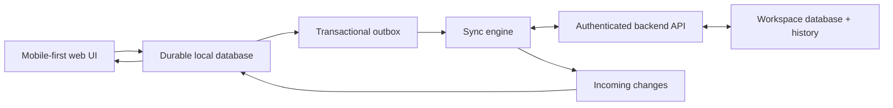

# RM Calendar — Data and Sync Architecture

**Version:** 0.1  
**Status:** Phase 1 draft  
**Depends on:** [Domain Model](Domain-Model.md), [Business Rules](Business-Rules.md), [Critical Workflows](Critical-Workflows.md)

> **Scope amendment:** Local-first behavior remains required. Because the initial audience is LDS members and returned missionaries, treat people, household, location, and pastoral notes as sensitive data per [Scope-Decision-LDS.md](Scope-Decision-LDS.md).

## 1. Decision

RM Calendar is **local-first**. The web application keeps a durable local copy of the active Workspace and records every change locally before reporting success. The backend synchronizes, secures, and shares data; it is not the only place a field worker’s current work exists.

## 2. Why this is required

Field work happens in lifts, basements, rural areas, public transport, and buildings with poor reception. A cloud-only design would make the central product promise unreliable. The web beta is web-first with a phone-sized, mobile-first interface and browser-local persistence; it remains usable on larger screens but does not initially optimize desktop workflows. Later native apps reuse the same synchronization contract.

## 3. Logical architecture

The UI reads the local database. It must not wait on the network to render existing work.

## 4. Record envelope

Every synchronized record carries these conceptual fields in addition to domain data:

| Field | Purpose |
| --- | --- |
| `id` | Globally unique identifier generated by the client when offline. |
| `workspace_id` | Data and authorization boundary. |
| `created_at`, `updated_at`, `deleted_at` | Lifecycle and tombstone information. |
| `created_by`, `updated_by` | Accountability. |
| `revision` | Server-issued concurrency marker. |
| `base_revision` | Revision a client last observed before mutating an existing server record; sent with the outbox operation as a concurrency precondition. |
| `client_updated_at` | Supports diagnosis and user-facing ordering; it is not the sole conflict authority. |
| `sync_state` | Local-only status: synced, pending, failed, or needs attention. |

Activity and Task state transitions also generate append-only history events. Domain identifiers must remain stable across web and native clients.

## 5. Write path

Every create, update, completion, cancellation, restoration, or follow-up uses one local transaction:

1. Validate the action against Business Rules.
2. Write the changed record(s) to the local database.
3. Append state/history events where required.
4. Add one or more ordered outbox operations.
5. Mark affected records `pending`.
6. Commit the local transaction.
7. Update the UI immediately.

For compound actions—especially Follow-up creation—the target record, Follow-up link, and outbox entries are committed together. The server processes the compound action in one atomic transaction/command: it either persists every linked record or none. A browser/app restart may delay sync but must never leave only half of the action visible.

## 6. Synchronization cycle

The sync engine runs after authentication, when connectivity returns, after foregrounding, on an explicit user retry, and at safe periodic intervals while active.

1. **Pull:** request server changes after the locally stored cursor.
2. **Apply:** validate incoming changes, update local records, and advance the cursor only after a durable local commit.
3. **Push:** send queued outbox operations in dependency order.
4. **Acknowledge:** accept server revisions, mark operations complete, and remove safely acknowledged outbox entries.
5. **Repeat:** pull again when the push yields changes that affect the local state.

Pull-before-push minimizes avoidable conflicts; push must still work when the device has created data with no prior pull.

## 7. Operation ordering and idempotency

- Every outbox operation has an immutable operation ID.
- The backend treats a repeated operation ID as the same request, not a second mutation.
- A Contact or Place must synchronize before a newly linked Activity when the backend requires the referenced record.
- Follow-up target and source-link operations are always sent as one atomic server transaction/command; an idempotent transaction key makes retries safe without weakening all-or-nothing persistence.
- The client never removes an outbox operation solely because a network request timed out.
- Every mutation of an existing record carries its `base_revision`. The server rejects a stale semantic edit with conflict data rather than silently applying last-write-wins.

## 8. Conflict policy

### Automatic resolution

The system may automatically merge non-overlapping changes, such as a new Note added while another device changes an Activity title. Soft-deletion versus ordinary edit follows server policy and must preserve recoverability.

### User-visible conflict

When two edits change the same meaningfully conflicting field or state, the record enters `needs attention`:

- both local and server versions are retained for resolution;
- the record is visibly marked in its detail view and Sync Status;
- normal unrelated work remains usable;
- the user can choose local, server, or a manually merged value;
- resolution creates a new revision and immutable history event.

The system must never silently discard a completed outcome, cancellation, or user-entered note.

## 9. Deletion and retention

Deletion creates a synchronized tombstone rather than immediately erasing data. Tombstones prevent a stale offline device from resurrecting deleted data. The server retains tombstones for a defined future retention period; clients may compact local storage only after the server confirms it is safe.

## 10. Browser and native implementation boundary

The web beta needs a durable browser database, synchronization while active or resumed where browser limits permit, and an obvious manual Sync Status fallback. It must not claim guaranteed background sync after the browser is closed.

Native applications later implement the same envelopes, outbox semantics, conflict rules, and backend API. They may add more reliable background scheduling and local notifications without changing user data or workflow rules.

## 11. Security and privacy requirements

1. Local data is scoped to the authenticated Workspace and cleared safely on sign-out.
2. The API authorizes every read/write by workspace membership; clients cannot select another workspace identifier to access its data.
3. Tokens are never stored in logs, notes, or sync diagnostics.
4. Sync diagnostics use record metadata and operation IDs, not private note contents, unless the user explicitly exports support data.
5. Attachments are deferred until their upload, offline queueing, and protected access model are designed.

## 12. Verification scenarios

- Create a Contact, Activity, completion note, and Follow-up while offline; restart; reconnect; verify each exists once on a second signed-in client.
- Time out a successful write response; retry; verify the server has one mutation, not two.
- Change the same Activity outcome on two clients; verify `needs attention` retains both values.
- Delete a Contact on one client while another is offline; reconnect the second client; verify the Contact is not resurrected and history stays readable.
- Create a follow-up offline; restart before reconnecting; verify the target and source link persist and synchronize atomically.

## 13. Decisions deferred to technical design

- Browser local-database library
- Backend provider and database technology
- Authentication mechanism
- Cursor, revision, and transaction-key formats
- Exact server merge rules and retention period
- Attachment implementation
