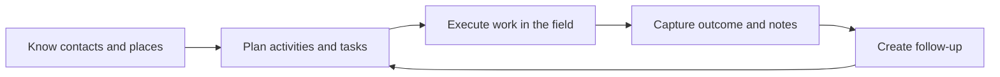
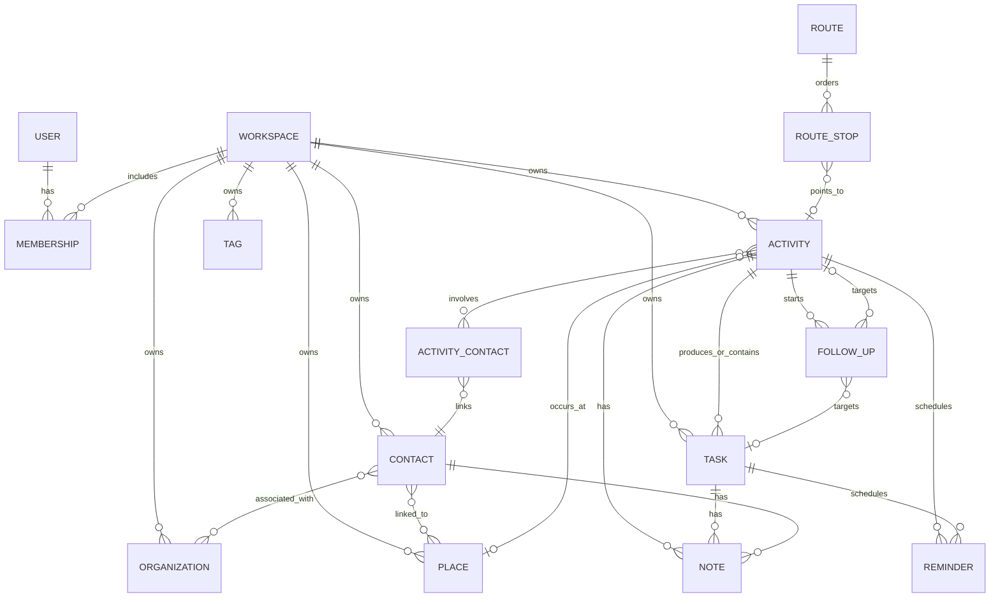
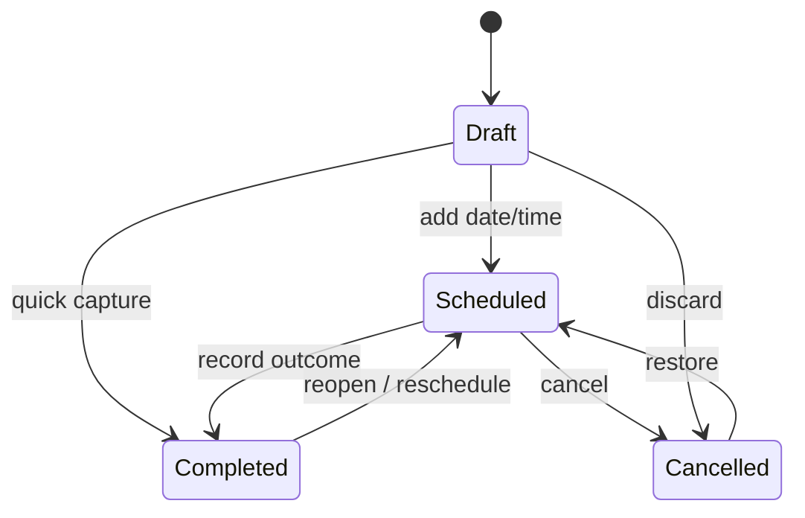

# RM Calendar — Domain Model

**Version:** 0.1 (conceptual model)  
**Status:** Draft for review  
**Depends on:** [Product Bible](Product-Bible.md)

> **Scope amendment:** Keep this reusable domain model, but implement its first visible vocabulary and workflows for LDS members and returned missionaries according to [Scope-Decision-LDS.md](Scope-Decision-LDS.md). It does not imply official Church data access.

## 1. Purpose

This document defines the business objects RM Calendar understands and how they relate. It is a conceptual model—not a database schema, API contract, or screen design. Its job is to make later technical decisions coherent.

## 2. The field-work loop

RM Calendar is organized around one repeatable loop:

The main domain objects exist to support this loop. A feature outside the loop needs strong product justification.

## 3. Core entities

### Workspace

A private data boundary that contains a user’s or team’s field-work records. It owns configuration such as timezone, labels, activity types, and sharing rules.

**Why it exists:** even a solo user should have a boundary that can later become a team without migrating every record.

### User

An authenticated person who can belong to one or more workspaces.

### Membership

The relationship between a User and Workspace. It determines role and access. Beta can expose only an `owner` role while retaining the model for future `member` and `manager` roles.

### Contact

A person the user plans, conducts, or follows up on work with. A contact may have multiple phone numbers, email addresses, tags, notes, organizations, and places.

**Important:** a Contact represents a person—not a device contact, customer-account record, or calendar attendee imported from elsewhere.

### Organization

A reusable group or entity associated with contacts, such as a company, household, branch, team, client account, or community group.

### Place

A reusable physical location. It may include a human-friendly name, postal address, coordinates, entrance notes, and map provider metadata.

### Activity

The central record of planned or completed field work. A workspace may label it “Visit,” “Meeting,” “Call,” or another term, but the domain meaning remains the same.

An Activity can have:

- a time range or all-day schedule;
- zero or more Contacts through explicit `ActivityContact` links, with at most one link marked as its primary Contact;
- one primary Place;
- objectives before the work;
- an optional short outcome after the work;
- notes, tasks, follow-ups, and attachments;
- a lifecycle state.

### Task

A discrete action. A Task can be independent or linked to a Contact, Organization, Place, or Activity. Tasks may have a due time, priority, completion time, and a parent task for lightweight subtasks. Independent tasks may be undated; a Task created as a Follow-up requires a due date.

Tasks have three states: `Open`, `Completed`, and `Cancelled`. An independent Task may have no due date or time. A Task created as a Follow-up must have a due date (with time optional). Completed and cancelled tasks remain visible in their source activity history when they are linked as follow-ups. Every Task state transition creates an immutable history event.

### Outcome (conceptual)

An Outcome is the concise result of completed field work: for example, a decision, observation, or result that explains what happened. In beta it may be captured as an optional short field on an Activity or as a Note; this does not require a separate storage entity. It belongs only to a completed Activity and is distinct from the Activity's immutable state/history events.

### Note

Free-form context captured against a single primary record (Contact, Organization, Place, Activity, or Task). Notes can be pinned and timestamped.

### Reminder

A user-facing prompt to act at or before a defined time. It belongs to either an Activity or Task. A Reminder is delivery intent; the system may later use local notifications, push notifications, or both to fulfil it.

### Tag

A user-defined label used for filtering and lightweight categorization. Tags can apply to Contacts, Organizations, Places, Activities, and Tasks.

### Attachment

A file or photo connected to a record. It stores metadata and a protected file reference; the product must not assume every attachment is publicly shareable.

### Follow-up

An explicit link that says completed work resulted in future work. It connects one **completed source Activity** to exactly one newly created **target Task or target Activity**—never both.

**Why it is explicit:** a generic note that says “follow up next week” is not enough for dependable reporting or reminders.

### Route and Route Stop (later v1)

A Route is an ordered set of activities or places planned for a field session, usually a day. A Route Stop preserves user-selected order; it does not promise automatic travel optimization.

## 4. Conceptual relationship map

The diagram describes business relationships, not storage implementation. `ActivityContact` is an explicit link between one Activity and one Contact; an Activity can have many such links, but no more than one may have `is_primary = true`. A Follow-up has exactly one target: a Task **or** an Activity, and its source must already be Completed. The database design must enforce these rules with validation and referential integrity.

## 5. Entity ownership and visibility

| Entity | Owned by | Initial visibility |
| --- | --- | --- |
| Workspace | One or more owner memberships | Workspace only |
| Contact, Organization, Place | Workspace | Workspace only |
| Activity, Task, Note, Reminder, Tag, Attachment | Workspace | Workspace only |
| Follow-up, Route | Workspace | Workspace only |

Every product record belongs to exactly one Workspace. Records must never cross workspace boundaries through links, search, syncing, or attachments.

## 6. Activity lifecycle

Activities use a deliberately small state machine:

### State definitions

- **Draft:** saved but not yet time-bound or ready to appear in the active plan. A user may complete a Draft directly for quick capture; it does not first need to become Scheduled.
- **Scheduled:** planned work that appears on the relevant calendar or agenda.
- **Completed:** work occurred; it should have a completion time and may have an outcome.
- **Cancelled:** work will not occur; the record remains in history with an optional reason.

An activity cannot be completed without a completion timestamp. An outcome is strongly encouraged but must not block rapid capture in beta.

Every activity state transition creates an immutable history event with the previous state, new state, timestamp, and actor. State/history events are append-only: later corrections add a new event rather than changing the prior event. This is the minimum audit record needed to explain cancellation, reopen, and correction behavior.

## 7. Primary workflows expressed in domain terms

### Plan an activity

1. Choose or create a Contact when the activity is relationship-based.
2. Optionally link an Organization and Place.
3. Create an Activity with schedule, type, objectives, and reminders.
4. The Activity becomes `Scheduled` and is visible in the calendar and agenda.

### Complete field work

1. Open the scheduled Activity.
2. Mark it `Completed` with completion time.
3. Capture a short outcome or Note.
4. Optionally create a Task or next Activity.
5. If created from this context, link it through a Follow-up.

### Capture an unscheduled interaction

1. Start from a Contact, Place, or quick-add action.
2. Create an Activity with the actual time and mark it `Completed`.
3. Add an outcome and next action if required.

### Create independent work

1. Create a Task with an optional due time, Contact, and priority.
2. Complete it, defer it, or convert/schedule it into an Activity.

## 8. Essential invariants

These rules must hold in every client and server implementation:

1. Every business record has one Workspace owner.
2. Every relationship connects records in the same Workspace.
3. An Activity has at most one primary Place; additional context belongs in notes or a later multi-stop design.
4. An Activity may involve zero or more Contacts—unscheduled admin work is valid—and at most one of those contacts is primary.
4a. Contacts are related to Activities only through `ActivityContact`; an Activity can have many links but no more than one link may be primary.
5. A Contact may have many Activities across time.
6. A completed Activity retains its original schedule and records the actual completion time separately.
7. A Follow-up has exactly one completed source Activity and exactly one target Task **or** target Activity.
8. A Reminder belongs to exactly one Task or Activity.
8a. A Follow-up is created atomically with exactly one target, so the target cannot exist as a successful follow-up without its source link.
9. Deleting a Contact must not silently erase completed Activity history; the deletion behavior must preserve referential integrity and auditability.
10. A user-facing deletion is reversible until a later retention policy is established; background sync must propagate it safely.
11. An Activity is either a Draft without a schedule, an all-day Activity with a date and no start/end time, or a Scheduled Activity with a start/end time range. Only all-day and Scheduled Activities are valid calendar commitments.
12. An unresolved concurrent-edit conflict is visible as `needs attention`; neither version may silently overwrite the other.

## 9. Common fields for future data and sync design

Most workspace-owned records will require these conceptual attributes:

- globally unique identifier, generated on-device when offline;
- workspace identifier;
- creator and last editor identifiers;
- creation, update, and deletion timestamps;
- a server revision or comparable concurrency marker;
- a soft-delete marker;
- immutable state/history events for activity and task lifecycle changes;
- a visible conflict state when automatic synchronization cannot reconcile concurrent edits;
- normalized client operation metadata for synchronization.

This is a domain requirement for offline reliability. The actual database fields and conflict policy are deliberately deferred to the Data and Sync Architecture.

## 10. Decisions deferred to later artifacts

- Exact database tables, column types, indexes, and RLS policies
- API endpoints and payload shapes
- Field-level permissions and team roles beyond beta ownership
- Recurrence for activities and tasks
- Contact import and external calendar integration
- Multiple locations or travel segments within a single activity
- Attachment storage provider and retention policy
- Conflict resolution rules for simultaneous edits

## 11. Questions to validate with beta users

1. Do users naturally distinguish a planned Activity from a Task, or should the UI conceal that distinction more often?
2. Is a Contact’s primary Place sufficient in most cases, or does daily field work frequently move between locations?
3. Which outcomes need structured fields, and which should remain flexible notes?
4. Is the term “Activity” acceptable as an internal concept while workspaces display local labels?
5. How often do users need multiple Contacts on one activity?

## 12. Next artifact

The next step is **Core Workflows**. It will specify the user flows, decisions, edge cases, and acceptance criteria for planning, completing, and following up on work. Those workflows will then drive navigation, business rules, sync behavior, and UI.
