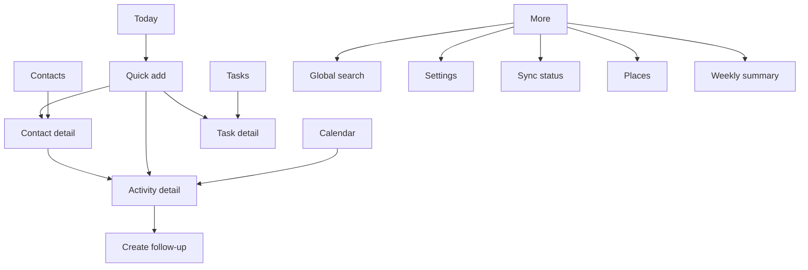

# RM Calendar — Information Architecture

**Version:** 0.1  
**Status:** Phase 1 draft  
**Depends on:** [Product Bible](Product-Bible.md), [Domain Model](Domain-Model.md), [Critical Workflows](Critical-Workflows.md)

## 1. Purpose

This document defines where users go to plan, execute, capture, and review field work. It assigns a clear responsibility to each surface before visual design begins.

## 2. Navigation principles

1. **Today is the home of action.** Opening the app should answer what matters now.
2. **Calendar is for planning time.** It is not the only place to find work.
3. **Contacts are the home of relationship context.** Activity history belongs with the person as well as the date.
4. **Tasks stay visible until resolved.** They cannot disappear into a calendar-only view.
5. **Creation is always nearby.** The user can create an activity, task, or contact from every primary area.
6. **Search is global.** People, places, activities, and tasks are discoverable from one entry point.
7. **Sync is visible but quiet.** Normal pending work should reassure, not distract; action is required only for failures or conflicts.

## 3. Primary navigation (mobile-first)

**Delivery contract:** v1 is a web-first beta with a phone-sized, mobile-first interface. It runs in a browser and remains usable on larger screens, but the initial interaction and layout decisions optimize for a handheld device. Native mobile applications follow only after web-beta workflow validation and launch-budget planning.

### Bottom navigation

| Area | Primary responsibility | Persistent action |
| --- | --- | --- |
| Today | Prioritized view of scheduled, due, and recently completed work | Quick add |
| Calendar | Day/week/agenda planning and rescheduling | Add activity |
| Contacts | Find people and view their context/history | Add contact |
| Tasks | Manage open, due, completed, and cancelled tasks | Add task |
| More | Supporting tools, review, and product configuration | Search, weekly summary, settings, sync |

`Places` remains under More in beta. It can move into primary navigation only if research shows users open it as often as Contacts or Tasks.

## 4. Surface responsibilities

### Today

The default landing screen. It combines:

- scheduled activities for today;
- overdue and due-today tasks;
- an optional next-up emphasis;
- recently completed work;
- a compact sync-health indicator.

Today does not replace Calendar; it answers what to do **now**.

### Calendar

Day is the default planning view. Week and agenda views provide alternative planning density.

Calendar shows only time-bound or all-day Activities. Undated Tasks belong to Today and Tasks, not in an artificial time slot.

### Contacts

Contacts is a searchable, filterable directory. Contact detail answers:

- who the person is and how to reach them;
- their organizations and places;
- their upcoming activities and open tasks;
- their completed activity history, outcomes, and notes;
- the fastest next action.

### Tasks

Tasks separates **Open**, **Completed**, and **Cancelled** work. Open tasks are grouped by overdue, today, upcoming, and undated. A task linked to a completed Activity exposes its follow-up origin.

### Activity detail

Activity detail is the execution and capture surface. It provides planned context before the work and completion, outcome, notes, reschedule/cancel, and follow-up actions afterwards.

### Quick add

Quick add first asks what the user is creating: Activity, Task, Contact, or quick completed Activity. It preserves entered context when the user creates a missing contact or place inline.

### Global search

One search field returns grouped results for Contacts, Places, Activities, and Tasks. Search results must never cross workspace boundaries.

### Sync status

Normal status is compact. The full screen lists pending changes, last successful sync, actionable failures, and visible `needs attention` conflicts. It does not expose raw technical logs as the default experience.

### Weekly summary

Weekly summary is a lightweight review surface under More. It shows completed activities, cancellations, open follow-ups, and overdue tasks for the selected week. It is generated from normal work records; it never requires duplicate reporting entry.

## 5. Core navigation flows

### Plan a visit

`Today or Calendar → Quick add / selected time → Activity form → optional inline Contact or Place → save → Calendar and Today`

### Complete field work

`Today or Calendar → Activity detail → Complete → optional outcome/note → optional Create follow-up → Today`

### Work from relationship context

`Contacts → Contact detail → Create Activity or Task → save → Contact detail with linked work`

### Recover from sync problem

`Sync indicator → Sync status → inspect plain-language issue → retry or resolve conflict → return to originating record`

### Review the week

`More → Weekly summary → select week → inspect completed work, cancellations, and open follow-ups → open linked record when action is needed`

## 6. First-use information architecture

First use should create a personal Workspace, confirm timezone, and offer—but never require—the user to add their first Contact and Activity. The user can skip directly to an empty Today screen and start working.

No industry, job title, or medical terminology is required during onboarding. Configurable vocabulary is later settings work, not an onboarding gate.

## 7. Permissions and future team navigation

Beta navigation assumes one owner in a personal workspace. A later team workspace adds people and shared views under More or a dedicated Workspace switcher; it must not disturb the core five-item navigation.

## 8. Out of scope for this information architecture

- Pixel-level visual design
- Route optimization or turn-by-turn navigation
- Supervisor dashboards
- External calendar integration
- Desktop/web layout

## 9. Decisions to validate

1. Whether Today or Calendar should be the first tab after beta usability testing.
2. Whether Places needs primary navigation for the initial target users.
3. Whether field users prefer a persistent floating add button or contextual create controls.
4. Whether a separate completed-work view is useful beyond Contact history and Today.

## 10. Exit criteria

- [x] Every Phase 0 critical workflow has a clear entry point and destination.
- [x] Every domain object has an intentional primary home.
- [x] Undated work, offline state, and error recovery have an accessible surface.
- [x] The beta navigation is small enough for one-handed, frequent field use.
