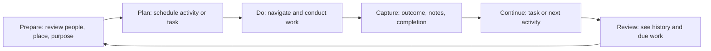

# RM Calendar — Phase 0: Product Discovery

**Version:** 0.1  
**Status:** Complete working baseline  
**Depends on:** [Product Bible](Product-Bible.md), [Domain Model](Domain-Model.md)

## 1. Discovery conclusion

RM Calendar should begin as a focused mobile field-work planner—not an all-purpose calendar or a full CRM. Its first useful loop is simple:

> Know the people and places involved, plan the work, capture what happened, and reliably act on what comes next.

This focus is broad enough for several field professions while still specific enough to drive product decisions.

## 2. Problem statement

People working out in the field lose continuity between a planned appointment and the work that follows it. A calendar can hold time, a contact app can hold a person, and a map can hold a location, but none naturally preserve the objective, outcome, and next action as one connected record—especially without reliable internet.

## 3. Initial personas

These are hypothesis personas for beta recruitment, not claims about all users.

### A. Independent field representative — primary beta persona

**Context:** Spends most weekdays travelling between contacts and locations. Uses a phone as the primary work device and may have intermittent connectivity.

**Needs:** A dependable daily agenda; rapid activity capture; contact history; reminders; confidence that offline work will not vanish.

**Frustrations:** Re-entering the same details, forgotten follow-ups, scattered notes, and calendars that understand time but not customer or field context.

**Success moment:** “I finished the visit, recorded the result, and set the next step before walking away.”

### B. Relationship-based mobile professional — secondary beta persona

**Context:** Manages appointments and repeat relationships across a territory, but does not identify as a conventional salesperson.

**Needs:** A flexible vocabulary, personalized contact records, repeatable follow-up, and an uncluttered way to see what is due.

**Frustrations:** Industry-specific apps that do not fit their work, generic task tools that disconnect tasks from people and places.

**Success moment:** “This works for my kind of field work without forcing me into someone else’s terminology.”

### C. Field-work supervisor — future persona, not v1 driver

**Context:** Coordinates a small group and needs visibility of coverage, workload, and completed work.

**Needs:** Shared records, permissions, summaries, and trustworthy activity history.

**Why deferred:** Team sharing changes data ownership, privacy, permissions, notifications, conflict handling, and reporting. It must be designed deliberately after the single-user loop is proven.

## 4. Competitive and positioning analysis

| Product category | Useful strengths | Gaps RM Calendar should address |
| --- | --- | --- |
| Generic calendars | Fast time scheduling, familiar views, reminders | Weak relationship, place, outcome, and follow-up context |
| Task managers | Flexible lists and priorities | Tasks often detach from contacts, appointments, and field locations |
| CRMs | Rich customer history and reporting | Often too heavy and office-oriented for fast mobile field capture |
| Field-service systems | Work orders, routes, dispatch | Usually prescriptive and industry-specific; can be excessive for individual relationship work |
| Legacy field-planning workflows | Proven planning and follow-up habits | Commonly dated, fragmented, or difficult to use offline on modern mobile devices |

**Positioning:** RM Calendar combines the quick planning familiarity of a calendar with the connected record of a lightweight field-work system. It is intentionally not a copy of any existing interface or proprietary workflow.

## 5. Feature inventory and release boundary

### Core beta: prove the daily loop

- Personal workspace and authentication
- Contacts, organizations, and reusable places
- Calendar/agenda with planned and completed activities
- Tasks, reminders, notes, outcomes, and explicit follow-ups
- Search, basic filtering, and activity history
- Offline creation and editing with durable synchronization
- A simple weekly review

### Next: strengthen daily field use

- Map and manually ordered day routes
- Attachments and photos
- Configurable terminology, activity types, colors, and tags
- Repeating activities and tasks
- Exportable individual reports

### Later: add collaboration carefully

- Workspace members and roles
- Shared calendars and shared contact records
- Supervisor coverage and workload views
- Advanced reporting and integrations

### Explicitly out of scope for the first product

- Medical, pharmaceutical, financial, or other industry-specific data model
- Sales pipelines, invoices, inventory, samples, expenses, or billing
- Automatic route optimization
- Broad AI assistant or AI-generated customer advice
- Pixel-level imitation of other products

## 6. Workflow analysis

The product should support the following field-work loop without forcing a prescribed industry process:

### Requirements inferred from this loop

1. The plan must be visible without hunting across multiple tabs.
2. Contacts and places must be reusable rather than repeatedly typed.
3. A completed activity must preserve both the original plan and what actually happened.
4. A follow-up must become a real, visible future commitment—not remain only inside a note.
5. Connectivity loss must not prevent planning or capture.
6. Weekly review must be based on records created during normal use, not separate reporting data entry.

## 7. Differentiation principles

- **Context over disconnected records:** People, places, activities, tasks, and notes relate directly.
- **Field speed over administrative depth:** Capture the essential outcome first; detailed fields can follow.
- **Adaptable language over industry lock-in:** Workspaces can rename concepts without changing the underlying model.
- **Reliable local work over cloud-only assumptions:** An unavailable network should create a visible pending state, not a blocked user.
- **Original implementation over imitation:** Inspiration informs needs, not branding, assets, screen designs, or copied behavior.

## 8. Assumptions to test in beta

| Assumption | Evidence needed | Decision if disproven |
| --- | --- | --- |
| Users will prefer a connected activity record over a simple calendar event. | Observe five users plan and complete real work. | Simplify activities and reduce mandatory associations. |
| A generic vocabulary can still feel natural. | Test visible labels with users from at least two field-work contexts. | Introduce configurable labels earlier. |
| Offline reliability is a meaningful reason to choose the product. | Interview and diary evidence of poor-signal work. | Reprioritize sync investment only if evidence is consistently weak. |
| Individual workflows are valuable before team features. | Weekly retention and user feedback from solo beta users. | Accelerate workspace sharing discovery if coordination blocks adoption. |
| The name “RM Calendar” does not exclude intended beta users. | Ask unprompted comprehension and appeal questions during recruitment. | Use a broader descriptive tagline or reconsider brand architecture before launch. |

## 9. Beta-research plan

Recruit 10–20 people who make recurring field visits or relationship-based appointments. Include a mix of users familiar with legacy field-planning tools and users who currently rely on generic calendar/task tools.

For each participant:

1. Ask them to reconstruct a real day of work.
2. Observe them create a contact, plan an activity, and add a task.
3. Simulate no connectivity; ask them to complete and follow up on an activity.
4. Ask what information they expected to see but could not find.
5. Follow up after one and three weeks to learn whether the daily loop became habitual.

## 10. Decisions made in Phase 0

| Decision | Status |
| --- | --- |
| Build for general field work, not one medical or pharmaceutical niche. | Decided |
| Keep calendar as the main daily interface. | Decided |
| Treat contacts, places, tasks, activities, and follow-ups as connected first-class concepts. | Decided |
| Design for offline work from the start. | Decided |
| Start with the individual field worker before collaboration. | Decided |
| Implement an original product inspired by needs, not a clone. | Decided |
| Pick mobile platform and technical stack. | Open for Phase 1 technical architecture |
| Set beta geography, localization, privacy requirements, and mapping budget. | Open before beta build |

## 11. Phase 0 exit criteria

- [x] Clear product vision, problem, and product boundary
- [x] Target users and hypothesis personas
- [x] Product principles and initial positioning
- [x] Feature inventory with a defendable beta boundary
- [x] Universal field-work loop identified
- [x] Originality and scope guardrails documented
- [x] Assumptions and beta research plan recorded

## 12. Handoff to Phase 1

Phase 1 begins with the detailed critical workflows. Once those workflows are accepted, they will determine the information architecture, business rules, data/sync design, and technical implementation plan.
