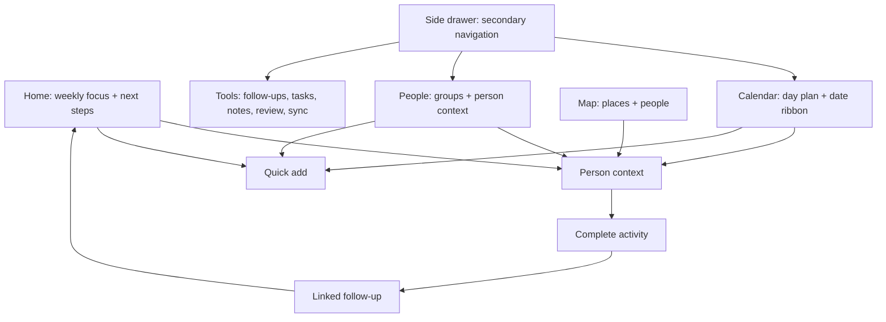
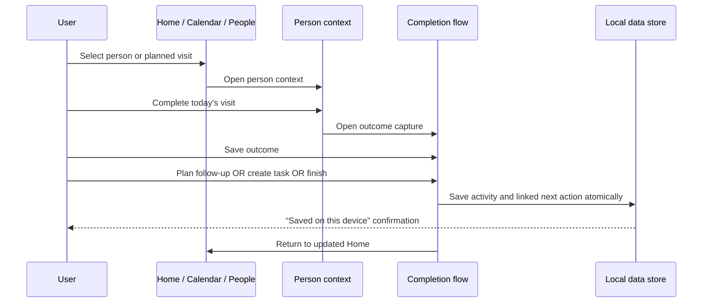

# RM Calendar — Phase 2 UX Specification

**Version:** 0.2  
**Status:** Complete — scope realigned to LDS members and returned missionaries  
**Last updated:** 2026-07-23  
**Supersedes:** Phase 2 v0.1 general-use direction  
**Prototype:** [Mission Companion Prototype](../design/RM%20Calendar%20%E2%80%94%20Mission%20Companion%20Prototype.html)

## 1. Product scope

RM Calendar is an independent planning companion for LDS members and returned missionaries who understand the planning rhythm of their mission and want a familiar way to organize people, visits, plans, notes, places, and follow-ups after missionary service.

It is **not** an official Church product, a replacement for official Church systems, or an affiliated version of Preach My Gospel. It must clearly state that it is independent and must never use official branding, logos, proprietary assets, source code, or copied screen designs.

The intended emotional response is: *“I immediately understand how to use this because I remember the workflow.”* The product achieves that through the familiar job sequence, not through a pixel-for-pixel reproduction.

## 2. Reference-informed design boundary

### Patterns retained

- A dark, focused mobile workbench.
- Five clear destinations: Home, Calendar, People, Map, and Tools.
- A dense day-planning view with a compact date ribbon.
- A Home view that makes weekly progress and the next people to contact visible immediately.
- A persistent quick-add action and a side drawer for secondary tools.
- Person context, notes, follow-ups, and planning in one connected workflow.

### Patterns intentionally made original

- RM Calendar uses its own name, logo direction, colors, typography, spacing, icons, copy, components, and demo data.
- The visual system uses deep navy/charcoal, teal, gold, and violet—not PMG's pink/magenta emphasis.
- Cards, tabs, date controls, sheets, map treatment, and navigation are independently designed.
- No PMG screen, screenshot, icon, asset, code, or exact layout is copied.

The user-owned Google AI Studio mockup repository may be used as a code and product-structure reference with the user's authorization. The local PMG material remains workflow and familiarity reference only.

## 3. Audience and context

### Primary users

1. Returned missionaries who miss the discipline and clarity of mission planning.
2. LDS members coordinating outreach, ministering, service, family-history, community, or personal faith-related follow-up.
3. Small local groups that may later need a simple, private way to remember people, plans, and commitments; this is not a v1-beta collaboration feature.

### Jobs to be done

- See what needs attention today and this week.
- Keep a person, their recent context, and their next step connected.
- Plan visits and activities without losing the day timeline.
- Capture an outcome quickly after meeting someone.
- Create a task or follow-up visit before moving on.
- See places and people together when planning an area.

## 4. Phase 2 information architecture

## 5. Screen specifications

### Home

**Purpose:** Answer “what matters now?” without making the user hunt through a calendar.

Required content:

- Weekly focus summary: people with next steps, visits planned, and today's plan.
- Three compact quick actions: plan day, record visit, quick note.
- “People needing a next step” list with person/household name, reason, and useful time or place context.
- One compact independent-product disclaimer in the prototype/about surface.

The home dashboard is a prioritization surface, not a report dump. A person row opens context directly.

### Calendar

**Purpose:** Plan and adjust time-bound activities.

Required content:

- Day-first timeline with actual activity blocks.
- Horizontal date ribbon.
- Lightweight visibility/filter control for activities, follow-ups, and completed items.
- Calendar items show title, time range, place/person context, and semantic activity color.
- Tapping a person-related item opens their context; creation opens a quick-add path.

Do not force undated tasks into fake time slots. They belong in Tools/Tasks and can be linked to people or activities.

### People

**Purpose:** Organize relationship context rather than only names.

Required content:

- Search entry point.
- Groups that reflect the user's own planning language, such as people with a plan, recently connected, people to find through, returning members, and households.
- Group summaries that reveal whether a next step exists.
- Person detail surface with Profile, Journey, and History tabs (or equivalent original labels).

The initial product supports user-configurable groups. It does not assume access to official membership records.

### Map

**Purpose:** Make place and people context practical when planning an area.

Required content:

- Marker treatment for people, places, and future activities.
- A selected-person/place card with a direct route into person context.
- A future-ready layers control.

The beta prototype may use a stylized map. Production maps require privacy review and explicit user consent before location data is stored or shared.

### Tools and side drawer

**Purpose:** Keep secondary capabilities reachable without crowding the bottom navigation.

Tools include Follow-ups, Tasks, Area Notes, Weekly Review, Sync Status, Map, Settings, and any later optional features. The drawer is grouped by planning tools and settings, not by a copied PMG menu hierarchy.

### Quick add

**Prototype requirement:** show a clear choice between planning an activity, adding a person/household, and capturing a quick note. It only needs to demonstrate where each choice goes; full create/edit forms are deferred.

**Functional beta requirement:** each choice opens a valid create flow with sensible context defaults. For example, Quick Add from Calendar defaults the date/time, and Quick Add from a person context pre-links that person.

## 6. Core flow: person → outcome → follow-up

Flow rules:

1. Recording an outcome is fast: one concise note is sufficient in beta.
2. The next action is explicit: schedule a follow-up, create a task, or intentionally choose none.
3. A created follow-up remains linked to the completed activity and person.
4. Local save happens before sync. The UI must not claim cloud sync until it has actually completed.
5. The canonical link model is explicit: completing an Activity may create one new Task or one new Activity. A separate Follow-up link records the originating completed Activity and targets exactly one of those new records. A Task or Activity is not itself a Follow-up.

## 7. Visual system: Mission Companion

| Token | Purpose | Prototype direction |
| --- | --- | --- |
| `surface-base` | App background | Deep navy-charcoal |
| `surface-raised` | Cards and sheets | Blue-charcoal |
| `accent-primary` | Primary action, healthy state | Teal |
| `accent-secondary` | Important planning emphasis | Gold |
| `accent-context` | Neutral activity category | Violet |
| `text-primary` | High-emphasis content | Soft white |
| `text-muted` | Supporting metadata | Blue-grey |

Design qualities:

- Dense enough for day planning; readable enough for one-handed use.
- Soft rounded surfaces but not a generic consumer calendar aesthetic.
- Clear action hierarchy: one visually dominant action per decision moment.
- Bottom navigation remains persistent on primary screens.
- Sheets are used for person context, quick add, and completion flow to preserve context.

## 8. Vocabulary

| RM Calendar term | Meaning |
| --- | --- |
| Person / Household | Someone or a family the user knows or is supporting |
| Visit / Activity | A scheduled time-bound interaction |
| Follow-up | A separate link from a completed activity to exactly one next Task or Activity |
| Area Notes | Private context related to a place/area, with user-controlled privacy |
| People with a plan | People who have a clear next action |
| Weekly focus | The user's current planning priorities |

This vocabulary can be extended by user configuration. The app must not present itself as an official Church record system or imply that it has official member data.

## 9. Privacy, safety, and product boundaries

1. Start local-first. User data is saved on the device before any optional cloud sync.
2. Do not include real member information in demos, screenshots, or seed data.
3. Require explicit user action before importing contacts, enabling location, sharing a profile, or syncing to a third party.
4. Do not collect or imply access to confidential Church records.
5. Keep the independence disclaimer accessible in About/settings and do not use Church branding.
6. Provide export/delete behavior before inviting real beta users.

### Decisions required before real beta data

Phase 3 must explicitly decide and document:

- browser-local storage technology and whether any at-rest protection is feasible;
- the exact delete, export, and account-removal journey;
- cloud-sync opt-in, retention, and recovery policy;
- location permission and map-data handling;
- whether beta is strictly private single-user or supports sharing.

**Beta collaboration boundary:** v1 beta is a private, single-user workspace. “Small local groups” describes a future audience, not an authorization to build sharing, roles, or shared records in the first beta.

**Disclaimer placement:** the public prototype includes the independence statement for clarity. The functional beta must display it during onboarding and in About/Settings; it does not need to consume Home-screen space after onboarding.

## 10. Prototype coverage and known deferrals

### Covered in the clickable prototype

- Mobile-first app shell and original visual direction.
- Home, Calendar, People, Map, Tools, side drawer, and quick add.
- Person context.
- Person → outcome → linked follow-up/task/no-follow-up flow.
- Local-save messaging and independent-product disclaimer.

### Deferred to Phase 3+

- Real persistence, authentication, workspace model, and sync queue.
- Create/edit forms and real filters/search.
- Live maps, routing, notifications, and contact import.
- Group configuration, reports, templates, and native mobile packaging.
- Security/privacy implementation and beta consent flows.

## 11. Phase 2 completion checklist

- [x] Scope changed from general field-work to LDS/RM companion.
- [x] PMG and user-owned prototype references analyzed.
- [x] Original reference-informed visual system documented.
- [x] Mobile-first clickable prototype created.
- [x] Home, Calendar, People, Map, Tools, drawer, and quick-add structure represented.
- [x] Core complete-activity-to-follow-up interaction represented.
- [x] Prototype JavaScript syntax checked and structural controls verified.
- [x] Privacy, independence, and reference boundaries documented.
- [x] Architecture handoff updated to supersede earlier general-use assumptions.

**Phase 2 exit decision:** the UX foundation is ready for Phase 3 technical implementation planning. Do not begin production UI code without keeping this specification, the scope decision, and the original-design boundary in view.
