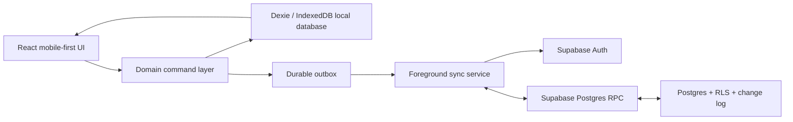

# RM Calendar — Phase 3 Implementation Plan

**Version:** 0.1  
**Status:** Complete technical plan — founder approval required before production scaffolding  
**Last updated:** 2026-07-23  
**Depends on:** [Scope Decision](Scope-Decision-LDS.md), [Phase 2 UX Specification](Phase-2-UX-Spec.md), [Domain Model](Domain-Model.md), [Business Rules](Business-Rules.md), [Data and Sync Architecture](Data-Sync-Architecture.md)

## 1. Phase 3 outcome

Phase 3 turns the approved LDS/RM product and UX decisions into an implementation-ready plan. It does **not** create a live Supabase project, send email, collect personal data, or begin production UI work. Those actions start only after the founder approves this plan.

The functional beta will be a private, mobile-first web application for one owner per workspace. It will be usable while offline after it has been opened at least once, save work locally before reporting success, and sync only when the browser is active or resumed. It must never claim background browser sync after the app has been closed.

## 2. Current-state evidence

1. The RM Calendar repository currently contains planning documents and HTML prototypes, not an application scaffold.
2. The user-owned Google AI Studio reference is a React/Vite mockup, but its `package.json` uses Tailwind 4. It is a UI/product reference only; it cannot be copied as this project mandates Tailwind 3.4.
3. The critical product requirement is local-first behavior with durable outbox operations and visible conflict recovery.
4. The first audience is LDS members and returned missionaries; the product is independent and must not claim Church affiliation, official records access, or PMG ownership.

## 3. Selected technical architecture



### Architectural rule

React components do not write directly to a remote API. They call a domain command. The command validates the requested action, commits domain records/history/outbox entries in one local Dexie transaction, and returns only after the local transaction succeeds. The sync service later delivers the operation.

This rule is what makes the UI genuinely local-first rather than merely showing cached server responses.

## 4. Technology decisions

| Concern | Selected approach | Why it fits RM Calendar | Explicit boundary |
| --- | --- | --- | --- |
| Web shell | React + TypeScript + Vite single-page app | Fast, mobile-first client application; matches the user-owned mockup’s general build shape without copying it | No SSR requirement in beta; pages can be added later if the public marketing site needs them |
| Offline app shell | `vite-plugin-pwa` with a generated Workbox service worker | Lets the app shell reload after its first successful visit when a connection is unavailable | Cache versioned static assets and navigation fallback only; do not cache authenticated API responses or promise background data sync |
| Styling | Tailwind CSS **3.4.17** plus project-owned CSS tokens | Required project constraint; supports the original Mission Companion system | Do not install Tailwind 4 or reuse reference classes wholesale |
| Navigation | React Router with route-backed sheets/details | Deep links, browser Back behavior, testable destination state | No desktop-first information architecture |
| Local data | Dexie + IndexedDB + `dexie-react-hooks` | IndexedDB is durable structured browser storage; Dexie transactions support atomic local commands and live queries | Browser storage is not a security vault and can be cleared by users/browsers |
| Validation | Zod schemas at form/command boundaries | Prevents invalid data entering the local outbox; types are inferred once | Server still validates; client validation is not authorization |
| Backend | Supabase: Postgres, Auth, RLS, database functions/RPC | Postgres relations fit the domain; RLS supports owner-only access; RPC can make compound sync operations atomic | Do not expose a service-role key or permit generic browser-side admin access |
| Authentication | Supabase six-digit email OTP for beta | Low-friction sign-in without password-reset support or cross-device redirect complexity | Custom SMTP and an approved sender domain are a real-beta gate; Supabase’s default SMTP is only for testing |
| Sync | Custom foreground sync service over authenticated Supabase RPC | Directly implements the already approved revision, idempotency, outbox, and conflict contract | Do not substitute a hidden last-write-wins sync library |
| Tests | Vitest for domain/local tests; Playwright for critical browser flows | Fast unit feedback plus real offline/restart/user-flow coverage | No “works in the prototype” claim without persistent-data tests |
| Maps | Typed places and optional external-map links first | Avoids premature map cost, background location, and sensitive-location handling | No background location, live map provider, or route optimization in the first functional beta |

The selections are grounded in official documentation: [React installation](https://react.dev/learn/installation), [Vite’s React/TypeScript templates](https://vite.dev/guide/), [Vite PWA service-worker setup](https://vite-pwa-org.netlify.app/guide/), [Tailwind 3.4.17](https://v3.tailwindcss.com/docs/installation), [Dexie transactions](https://dexie.org/docs/API-Reference), [IndexedDB](https://developer.mozilla.org/en-US/docs/Web/API/IndexedDB_API), [Supabase email OTP](https://supabase.com/docs/guides/auth/auth-email-passwordless), [Supabase RLS](https://supabase.com/docs/guides/database/postgres/row-level-security), and [Supabase RPC/database functions](https://supabase.com/docs/reference/javascript/rpc).

## 5. Application topology

The first production scaffold should use this layout:

```text
rm-calendar/
  src/
    app/                 # app startup, routing, providers, shell
    design-system/       # tokens and reusable original UI primitives
    features/
      auth/
      today/
      calendar/
      people/
      activities/
      tasks/
      follow-ups/
      places/
      notes/
      sync/
      settings/
    domain/              # types, invariants, pure command validation
    data/
      local/             # Dexie schema, repositories, migrations
      remote/            # Supabase client and typed RPC adapter
      sync/              # outbox processor, pull/apply, conflict logic
    lib/                 # date/time, IDs, result/error utilities
    test/                # test helpers and fixtures with fictional data only
  supabase/
    migrations/          # SQL schema, RLS, functions, triggers
    functions/           # only if an Edge Function is later justified
  e2e/                   # Playwright critical user flows
  docs/
```

`features/` owns screen-level behavior; `domain/` must not import React, Dexie, or Supabase; `data/` implements domain interfaces. This lets a later native client reuse the command rules and sync contract without copying UI code.

## 6. Component inventory and responsibilities

### Shared app shell

| Component | Responsibility | Canonical data source |
| --- | --- | --- |
| `AppBootstrap` | Opens local DB, restores session, starts safe foreground sync | local settings + auth session |
| `AppShell` | Phone-first width, safe areas, main content region | route state |
| `AppHeader` | Destination title, menu, quiet sync health | route + sync summary |
| `BottomNavigation` | Home, Calendar, People, Map/Places, Tools | route |
| `QuickAddSheet` | Activity, Person/Household, Note, quick completed Activity entry points | route context |
| `SyncStatusIndicator` | Pending/failed/conflict summary without alarming users | local sync metadata |
| `ToastRegion` | Local-save, queued-sync, error, and undo feedback | ephemeral UI state |
| `ConfirmDiscardDialog` | Protects unsaved form draft exits | local draft state |

### Home and planning

| Component | Responsibility |
| --- | --- |
| `TodayScreen` | Weekly focus, today agenda, due tasks, next actions, quiet sync status |
| `WeeklyFocusSummary` | Derived counts only; never a second reporting datastore |
| `NextActionList` | People/households with overdue or planned linked work |
| `AgendaSection` | Scheduled activities, all-day items, and completed work grouping |
| `QuickCaptureAction` | Creates a completed Activity with current date/time and optional person context |

### Calendar and activities

| Component | Responsibility |
| --- | --- |
| `CalendarScreen` | Day-first view with later week/agenda modes |
| `DateRibbon` | Changes local calendar date only; no server fetch gate |
| `CalendarFiltersSheet` | Activities, follow-ups, and completed-work visibility filters |
| `DayTimeline` | Renders timed and all-day Activities; does not display undated Tasks as fake appointments |
| `ActivityDetailSheet` | Shows planned intent, person/place context, history, and action buttons |
| `ActivityFormSheet` | Create, edit, schedule, reschedule, and draft behavior; a saved Draft clears schedule fields and stays out of the Calendar |
| `OverlapWarning` | Warns but never blocks overlapping activities |
| `CompletionSheet` | Captures actual completion time, outcome, and next-action decision |

### People, households, places, and notes

| Component | Responsibility |
| --- | --- |
| `PeopleScreen` | Searchable groups: planned people, recently connected, configurable groups |
| `PersonDetailSheet` | Profile, Journey, History, linked activities/tasks/notes, fastest next action |
| `PersonFormSheet` | Minimal inline-safe creation: display name required; other details optional |
| `HouseholdGroupView` | Displays a user-created household/group without claiming official records |
| `PlaceFormSheet` | Name/address/optional coordinate entry; mapping remains optional |
| `PlaceListScreen` | First functional place experience; map is a later slice |
| `AreaNotesScreen` | User-controlled notes linked to Place or workspace; no real Church data assumptions |

### Tasks, follow-ups, tools, and safety surfaces

| Component | Responsibility |
| --- | --- |
| `TaskListScreen` | Overdue, today, upcoming, undated, completed, and cancelled Tasks |
| `FollowUpFormSheet` | Creates one Task **or** one Activity plus its separate link atomically |
| `FollowUpOriginSection` | Shows the completed source Activity and target’s current state |
| `WeeklyReviewScreen` | Derived read-only summary from normal work records |
| `SyncStatusScreen` | Pending work, failures, last successful sync, conflict entry point |
| `ConflictResolutionSheet` | Shows local/server values and creates a new chosen/merged revision |
| `SettingsScreen` | Time zone, terminology, persistence request, export/delete, about/disclaimer |
| `PrivacyOnboarding` | Independent-product statement and explicit consent gates |

## 7. State model

### 7.1 Source-of-truth rule

| State kind | Owner | Persistence |
| --- | --- | --- |
| Domain records | Dexie local database | Durable IndexedDB |
| Sync/outbox/conflict state | Dexie local database | Durable IndexedDB |
| Server records | Supabase Postgres | Remote canonical copy after acknowledgement |
| Authentication session | Supabase client/session storage | Provider-managed, restored when available |
| Navigation/sheet selection | React Router + local React state | URL/history where meaningful |
| Form draft | local `drafts` table | Durable until submit/discard/expiry |
| Toast/focus/animation | component state | Ephemeral only |

No React Query/SWR server cache is needed for beta domain data: the local database is already the queryable, durable client source of truth. Screens subscribe to Dexie live queries; sync updates those tables and the UI reacts automatically.

### 7.2 Domain command boundary

Every write is expressed as an explicit command, for example:

- `createContact`
- `createActivity`
- `scheduleActivity`
- `rescheduleActivity`
- `completeActivity`
- `reopenActivity`
- `cancelActivity`
- `createTask`
- `createNote`
- `updateNote`
- `createFollowUp`
- `softDeleteRecord`
- `restoreRecord`
- `resolveConflict`

Commands must:

1. validate input against shared schemas and Business Rules;
2. load current local state needed for invariants;
3. write records, lifecycle history, and outbox operation(s) in one Dexie transaction;
4. mark changed records as `pending` where sync is enabled;
5. return a typed result for the UI.

Commands must **not** wait for fetch, Supabase, map, or notification work inside the Dexie transaction. External effects occur only after local commit.

### 7.3 Stable IDs and time

- Generate IDs on device with `crypto.randomUUID()` before local write.
- Timed Activities store UTC instants plus the intended IANA workspace time zone.
- All-day Activities store a workspace-local ISO date, never a midnight UTC timestamp.
- Completed Activities preserve scheduled fields and record `actual_completed_at` separately.
- The workspace time zone is set during onboarding and can be changed deliberately; changing it never moves all-day dates.

## 8. Local database and schema mapping

The detailed table/index plan is in [Database Schema Plan](Database-Schema-Plan.md). The minimum local tables are:

```text
workspaces, contacts, organizations, contact_organizations, places, contact_places,
activities, activity_contacts, tasks, follow_ups, notes, reminders, tags,
tag_assignments, activity_history, task_history,
drafts, outbox_operations, sync_metadata, conflicts, local_settings
```

Each synchronizable record carries local representations of `id`, `workspace_id`, lifecycle timestamps, `client_updated_at`, `revision`, `base_revision` for pending edits, `deleted_at`, and local `sync_state`. `client_updated_at` supports user-facing ordering and diagnostics only; expected revision remains the conflict authority. Local-only tables never synchronize.

## 9. Sync implementation plan

### 9.1 Remote contract

Supabase Postgres is the remote system of record for authenticated workspaces. The browser uses only the publishable client key and the authenticated user’s session. Row Level Security is enabled on every exposed data table. A user may only read or mutate rows in their own private beta workspace, which has exactly one owner membership that matches the workspace owner.

The browser does not receive database passwords or a service-role key.

The remote API starts with one narrowly scoped onboarding RPC plus two typed sync RPC contracts. `bootstrap_private_workspace` is the documented owner-bound bootstrap exception; the sync functions are `SECURITY INVOKER` Postgres functions unless a specific server-only reason is documented:

```text
bootstrap_private_workspace(workspace_name, timezone)
  -> { workspace_id }

pull_changes(workspace_id, after_cursor, page_size)
  -> { changes[], next_cursor, has_more }

apply_sync_batch(workspace_id, operations[])
  -> { results[] }
```

`apply_sync_batch` accepts immutable operation IDs, base revisions, and validated JSON payloads. It records an idempotency receipt before/with each successful logical mutation. A timed-out browser request is retried with the same operation ID; the server returns the prior result rather than applying a second mutation.

`create_follow_up` is one logical operation type. Its remote transaction creates exactly one target Task or Activity, exactly one Follow-up link, the target’s creation-history event, the source Activity’s `follow_up_created` history event, all applicable target Contact/Place links or carried-forward references, change-log entries for every created record, and one receipt—or creates none of them. The carried Contact/Place context is copied only from the source’s primary link/reference when it exists and remains user-editable before save.

### 9.2 Foreground sync cycle

1. Open local DB and restore the last authenticated workspace when safely available.
2. On sign-in, app resume, `online`, manual retry, and a conservative active-app interval, acquire the local sync mutex.
3. Pull remote changes after local cursor in pages.
4. Apply each page in a Dexie transaction. Never overwrite a locally pending semantic edit silently.
5. Push ready outbox operations in dependency order.
6. Acknowledge server revisions, delete only safely acknowledged outbox entries, and update local records/cursor atomically.
7. Pull once more after a successful push if the server generated relevant changes.
8. Release mutex and update quiet sync health.

`navigator.onLine` is a hint, not proof that the service is reachable. Actual request results decide retry behavior.

### 9.3 Conflict policy for beta

| Situation | Beta behavior |
| --- | --- |
| New Note or history event added on different devices | Both append-only records survive; pull them both |
| Same Contact/Activity/Task field changed from stale base revision | Server returns conflict; local record becomes `needs_attention` |
| Completion outcome changed on two devices | Never last-write-wins; show both values for user choice/merge |
| Remote tombstone vs offline edit | Tombstone is not silently undone; preserve local edit as conflict context and offer an explicit restore/new revision path |
| Duplicate retry after timeout | Receipt returns prior result; no duplicate record/history/link |
| Network unavailable | Keep operation queued, show local-save state, continue all core work |

### 9.4 Browser persistence behavior

After the user has meaningful data, the app may request persistent storage with `navigator.storage.persist()`. A denial is non-fatal: users are informed that browser storage can still be cleared under browser/device pressure and are encouraged to enable sync/export once those features are configured. The platform must never promise that browser storage is indestructible. See [MDN StorageManager.persist](https://developer.mozilla.org/en-US/docs/Web/API/StorageManager/persist) and [web.dev offline data guidance](https://web.dev/learn/pwa/offline-data/).

### 9.5 App-shell cache boundary

The service worker precaches only the versioned application shell, icons, fonts, and other static build assets needed to reopen the UI after one successful online load. It must not persist Supabase REST/RPC responses, auth responses, note/outcome content, or sync operations in the Cache API. Domain data remains in Dexie; the outbox runs only while the foreground application is active. A service worker does not turn this beta into a closed-browser sync service.

## 10. Security, privacy, and beta-data policy

### 10.1 Threat model and non-promises

The beta protects against cross-user cloud access through authentication and RLS. It does not claim to protect data from someone who can unlock the same browser profile/device. Browser IndexedDB is sensitive local data, not a substitute for device security.

No user should enter official Church record data, confidential pastoral material, or another person’s sensitive information without their own authority and consent. Use fictional seed data in all development, screenshots, and tests.

### 10.2 Required controls before real beta data

1. HTTPS deployment and explicit production redirect URLs.
2. Supabase RLS migration tests proving workspace isolation.
3. Custom SMTP and sender-domain configuration for invited users; Supabase’s default SMTP is testing-only and restricts recipients.
4. Onboarding consent and independent/non-affiliation disclaimer.
5. Settings controls to export user data and request/delete account data.
6. If the outbox has pending changes, sign-out offers **Sync now** or **Remove local data and sign out**; it never silently discards queued work. After the user chooses, sign-out clears the active workspace’s local database and in-memory state.
7. Sync logs contain operation IDs, record type/ID, and error code only—never note/outcome/body text.
8. No attachment upload, contact import, background location, shared workspace, or map provider until their consent/access model is approved.

### 10.3 Proposed beta retention

- User-visible deletion is a soft delete and creates a synchronized tombstone.
- Tombstones are retained remotely for **30 days** to prevent stale offline devices from resurrecting records; this is a proposed engineering retention window, not a public legal promise.
- Account deletion must remove/irreversibly anonymize the user’s workspace data after the agreed support/export window. The final product policy and jurisdictional wording require founder approval before public beta.
- Local data is cleared on sign-out; account deletion cannot be completed offline and must show a clear pending state if requested without connectivity.

## 11. Authentication and deployment gates

### Authentication

1. Development: local-only/demo workspace can be used with fictional data; no live user account is needed to develop local commands.
2. Closed technical test: Supabase Auth six-digit email OTP may use project-team addresses only.
3. Invited beta: custom SMTP, configured redirect URLs, rate-limit/anti-abuse controls, and a reviewed privacy/onboarding flow are mandatory before inviting non-team addresses.

### Deployment

The Vite build is static and can deploy to any HTTPS static host. Select the host only when a domain, preview workflow, and cost owner are known. The host must support:

- history-route fallback;
- HTTPS and stable allowed auth redirect URLs;
- environment variables at build/deploy time, never committed secrets;
- preview deployments separate from beta production;
- a documented rollback path.

## 12. Build milestones after founder approval

### Milestone 0 — Scaffold and guardrails

Create the React/Vite/TypeScript app, Tailwind 3.4.17 configuration, a static app-shell service worker, route shell, CSS tokens, lint/type/test commands, fake-data fixtures, and CI baseline. No real account or sync credentials.

**Exit evidence:** `typecheck`, unit tests, production build, and a phone-width visual smoke test pass.

### Milestone 1 — Local private workspace and design shell

Implement Dexie schema/migrations, local settings, app bootstrap, original Mission Companion shell, Home navigation, privacy/disclaimer surfaces, and a fake private workspace.

**Exit evidence:** local workspace opens after a browser reload; data never comes from hard-coded screen state after creation.

### Milestone 2 — People, places, calendar, and planning

Implement Contact/Household and Place commands, reusable local queries, People detail/history, Calendar day view/date ribbon, Activity draft/create/edit/reschedule, overlap warning, and durable drafts.

**Exit evidence:** a user can create a person inline, plan a visit, reload the browser, and see the same linked activity locally.

### Milestone 3 — Completion, outcome, task, and follow-up

Implement Activity and Task lifecycle/history, quick capture, Completion Sheet, Notes, Tasks, atomic Follow-up command, Today’s next-action derivation, and weekly review.

**Exit evidence:** the core Phase 2 flow works offline across browser restart; no successful follow-up can exist without both its target and source link.

### Milestone 4 — Authentication and remote sync

Create Supabase migrations/RLS/RPC tests, authenticated owner workspace, outbox processor, pull/apply cycle, pending status, idempotent retries, sync status screen, and conflict state.

**Exit evidence:** two signed-in browser profiles can synchronize a complete activity/follow-up exactly once; intentionally conflicting edits become `needs attention` without data loss.

### Milestone 5 — Privacy controls and beta readiness

Add export/delete flows, local clear-on-sign-out, storage-persistence request, accessible error recovery, onboarding disclaimer, authenticated email production configuration, deployment configuration, and manual beta script.

**Exit evidence:** privacy/recovery checklist passes with fictional data; no public beta invitation is sent until the founder approves the final policy and hosting/auth configuration.

### Deferred from functional beta

- Live map tiles, route optimization, background location, and turn-by-turn navigation.
- Attachments/photos and contact import.
- Shared workspaces, roles, supervisors, and official-data integrations.
- Push notifications that promise delivery while the web app is closed.
- Native Android/iOS packaging.
- AI features.

## 13. Verification strategy

| Layer | Evidence required |
| --- | --- |
| Pure domain | Vitest covers transitions, follow-up invariants, time rules, and deletion rules |
| Local persistence | Dexie/fake IndexedDB integration tests prove transaction rollback, reload survival, and drafts |
| Sync adapter | Contract tests cover receipt idempotency, base-revision conflict, pull cursor, and tombstones |
| Database | Supabase migration/RLS/RPC integration tests prove exact-one-owner isolation, compound follow-up atomicity, restore behavior, and historical-contact snapshots |
| Browser workflow | Playwright covers plan offline, reload, complete/capture/follow-up, reconnect, restore, and conflict recovery |
| Accessibility | Keyboard navigation, focus states, touch-target review, contrast checks, and no color-only state meaning |
| Privacy | Tests verify no note body in sync diagnostics and no cross-workspace query result |

The build cannot declare its offline promise complete until the critical scenarios in [Critical Workflows](Critical-Workflows.md) and [Data and Sync Architecture](Data-Sync-Architecture.md) are tested against persistence and a simulated network interruption—not merely against in-memory mock state.

## 14. Founder approval checklist

Before Milestone 0 begins, confirm these implementation choices:

**Founder approval recorded: 2026-07-23.**

- [x] Fresh React/Vite/TypeScript scaffold, not a fork of the reference mockup.
- [x] Tailwind CSS locked to 3.4.17.
- [x] Static PWA app-shell cache only; no authenticated API cache or closed-browser sync promise.
- [x] Dexie/IndexedDB local-first data layer.
- [x] Supabase Auth/Postgres/RLS/RPC remote sync approach.
- [x] Six-digit email OTP authentication with custom SMTP as an invited-beta gate.
- [x] Private single-owner workspace for beta; no sharing.
- [x] No live maps/attachments/contact import/background location in the first functional beta.
- [x] Proposed 30-day tombstone engineering window, subject to final product/privacy policy approval.

## 15. Phase 3 completion criteria

Phase 3 is complete when:

1. this plan and the [Database Schema Plan](Database-Schema-Plan.md) agree with the existing domain, workflow, business-rule, sync, and UX specifications;
2. a fresh reader can identify the chosen stack, local source of truth, sync strategy, privacy boundary, and first implementation milestone without hidden context;
3. the founder can approve or amend the choices before any live service/account or production-code scaffold is created.
